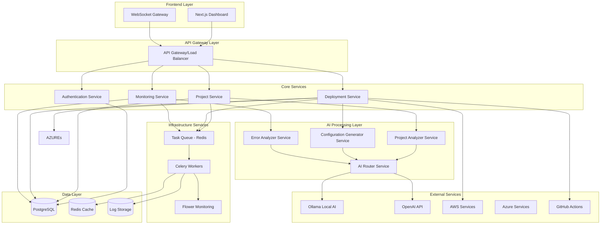

# Design Document: Deployment Automation System

## Overview

The Deployment Automation System is a comprehensive platform that leverages AI-driven analysis and microservices architecture to automate the entire deployment lifecycle. The system analyzes projects across multiple technology stacks, generates optimized deployment configurations, and provides intelligent monitoring and error resolution capabilities.

The architecture follows modern cloud-native principles with containerized microservices, asynchronous task processing, and scalable infrastructure. The system integrates dual AI execution pipelines (offline Ollama + online OpenAI/AWS) for intelligent project analysis and configuration generation, while maintaining high availability and performance through distributed processing.

## Architecture

### High-Level Architecture



### Microservices Architecture

The system is decomposed into focused microservices, each handling specific domain responsibilities:

**Frontend Services:**
- **Next.js Dashboard**: React-based user interface with Tailwind CSS
- **WebSocket Gateway**: Real-time communication for deployment status and logs

**Core Business Services:**
- **Authentication Service**: User management, JWT tokens, role-based access
- **Project Service**: Project metadata, analysis results, configuration storage
- **Deployment Service**: Orchestrates deployment workflows and cloud integrations
- **Monitoring Service**: Health checks, metrics collection, alerting

**AI Processing Services:**
- **Project Analyzer Service**: Scans projects, detects technologies, generates profiles
- **Configuration Generator Service**: Creates Dockerfiles, CI/CD pipelines, deployment scripts
- **Error Analyzer Service**: Analyzes failures, provides explanations and fixes
- **AI Router Service**: Routes requests between local Ollama and cloud AI services

**Infrastructure Services:**
- **Task Queue (Redis)**: Manages asynchronous job processing
- **Celery Workers**: Execute background tasks (deployments, analysis, monitoring)
- **Flower**: Monitors Celery tasks and worker health

## Components and Interfaces

### Project Analyzer Service

**Responsibilities:**
- Scan project directories and files
- Detect programming languages, frameworks, and build tools
- Extract dependencies and configuration details
- Generate comprehensive project profiles

**Key Interfaces:**
```python
class ProjectAnalyzer:
    def analyze_project(self, project_path: str) -> ProjectProfile
    def detect_language(self, file_extensions: List[str]) -> Language
    def identify_framework(self, config_files: List[str]) -> Framework
    def extract_dependencies(self, manifest_files: List[str]) -> Dependencies
    def generate_profile(self, analysis_results: AnalysisResults) -> ProjectProfile
```

**Technology Detection Logic:**
- **Language Detection**: File extension analysis, syntax parsing, configuration file patterns
- **Framework Identification**: Package.json, requirements.txt, pom.xml, Cargo.toml analysis
- **Build Tool Recognition**: Maven, Gradle, npm, yarn, pip, poetry detection
- **Dependency Extraction**: Version parsing, security vulnerability scanning

### Configuration Generator Service

**Responsibilities:**
- Generate optimized Dockerfiles for detected technology stacks
- Create CI/CD pipeline configurations (GitHub Actions, GitLab CI, Jenkins)
- Produce cloud-specific deployment scripts and Infrastructure as Code
- Apply security best practices and optimization patterns

**Key Interfaces:**
```python
class ConfigurationGenerator:
    def generate_dockerfile(self, project_profile: ProjectProfile) -> DockerConfig
    def create_cicd_pipeline(self, project_profile: ProjectProfile, platform: str) -> PipelineConfig
    def generate_cloud_config(self, project_profile: ProjectProfile, cloud_provider: str) -> CloudConfig
    def apply_security_policies(self, config: Config) -> SecureConfig
```

**Generation Strategies:**
- **Template-Based Generation**: Pre-built templates for common technology stacks
- **AI-Enhanced Customization**: LLM-powered optimization based on project specifics
- **Best Practice Integration**: Security scanning, performance optimization, cost efficiency
- **Multi-Environment Support**: Development, staging, production configurations

### Deployment Engine Service

**Responsibilities:**
- Execute deployment workflows across multiple cloud platforms
- Manage infrastructure provisioning and resource allocation
- Handle authentication and credential management
- Provide real-time deployment progress tracking

**Key Interfaces:**
```python
class DeploymentEngine:
    def deploy_application(self, deployment_config: DeploymentConfig) -> DeploymentResult
    def provision_infrastructure(self, infra_config: InfrastructureConfig) -> InfrastructureResult
    def manage_secrets(self, secrets_config: SecretsConfig) -> SecretsResult
    def track_deployment_progress(self, deployment_id: str) -> DeploymentStatus
```

**Cloud Platform Integrations:**
- **AWS Integration**: EC2, ECS, Lambda, RDS, S3, CloudFormation
- **Azure Integration**: App Service, Container Instances, Functions, SQL Database
- **Multi-Cloud Orchestration**: Consistent APIs across different cloud providers
- **Infrastructure as Code**: Terraform, CloudFormation, ARM templates

### Monitoring and Observability Service

**Responsibilities:**
- Collect application and infrastructure metrics
- Monitor deployment health and performance
- Generate alerts for failures and anomalies
- Provide comprehensive logging and tracing

**Key Interfaces:**
```python
class MonitoringService:
    def collect_metrics(self, deployment_id: str) -> Metrics
    def check_health(self, application_url: str) -> HealthStatus
    def generate_alerts(self, metrics: Metrics, thresholds: Thresholds) -> Alerts
    def aggregate_logs(self, deployment_id: str) -> LogAggregation
```

**Monitoring Capabilities:**
- **Real-Time Metrics**: CPU, memory, network, application-specific metrics
- **Health Checks**: Endpoint monitoring, dependency health, service availability
- **Log Aggregation**: Centralized logging with search and filtering capabilities
- **Alerting System**: Configurable thresholds, notification channels, escalation policies

### AI Router Service

**Responsibilities:**
- Route AI requests between local Ollama and cloud AI services
- Implement fallback strategies and load balancing
- Manage AI model selection based on task complexity
- Optimize costs and response times

**Key Interfaces:**
```python
class AIRouter:
    def route_request(self, ai_request: AIRequest) -> AIResponse
    def select_model(self, task_type: str, complexity: int) -> AIModel
    def implement_fallback(self, failed_request: AIRequest) -> AIResponse
    def optimize_routing(self, performance_metrics: Metrics) -> RoutingStrategy
```

**Routing Strategies:**
- **Local-First**: Use Ollama for simple tasks, cloud AI for complex analysis
- **Cost Optimization**: Balance between local processing and cloud API costs
- **Performance Optimization**: Route based on response time requirements
- **Fallback Mechanisms**: Automatic failover between AI services

## Data Models

### Core Domain Models

```python
@dataclass
class ProjectProfile:
    id: str
    name: str
    language: Language
    framework: Framework
    build_tool: BuildTool
    dependencies: List[Dependency]
    configuration_files: List[ConfigFile]
    analysis_timestamp: datetime
    confidence_score: float

@dataclass
class Language:
    name: str  # "Python", "JavaScript", "Java", etc.
    version: str
    detection_confidence: float
    file_patterns: List[str]

@dataclass
class Framework:
    name: str  # "React", "Django", "Spring Boot", etc.
    version: str
    configuration_files: List[str]
    dependencies: List[str]

@dataclass
class DeploymentConfig:
    id: str
    project_id: str
    target_platform: CloudPlatform
    environment: Environment
    dockerfile: DockerConfig
    cicd_pipeline: PipelineConfig
    infrastructure: InfrastructureConfig
    secrets: SecretsConfig
    created_at: datetime

@dataclass
class DeploymentResult:
    deployment_id: str
    status: DeploymentStatus
    application_url: Optional[str]
    infrastructure_details: InfrastructureDetails
    logs: List[LogEntry]
    metrics: DeploymentMetrics
    started_at: datetime
    completed_at: Optional[datetime]

@dataclass
class CloudPlatform:
    provider: str  # "AWS", "Azure", "GCP"
    region: str
    services: List[CloudService]
    credentials: CredentialConfig

@dataclass
class InfrastructureConfig:
    compute_resources: ComputeConfig
    storage_config: StorageConfig
    networking_config: NetworkConfig
    scaling_config: ScalingConfig
    security_config: SecurityConfig
```

### Database Schema Design

**Users Table:**
```sql
CREATE TABLE users (
    id UUID PRIMARY KEY DEFAULT gen_random_uuid(),
    email VARCHAR(255) UNIQUE NOT NULL,
    password_hash VARCHAR(255) NOT NULL,
    full_name VARCHAR(255),
    role VARCHAR(50) DEFAULT 'developer',
    created_at TIMESTAMP DEFAULT CURRENT_TIMESTAMP,
    updated_at TIMESTAMP DEFAULT CURRENT_TIMESTAMP
);
```

**Projects Table:**
```sql
CREATE TABLE projects (
    id UUID PRIMARY KEY DEFAULT gen_random_uuid(),
    user_id UUID REFERENCES users(id) ON DELETE CASCADE,
    name VARCHAR(255) NOT NULL,
    repository_url VARCHAR(500),
    project_profile JSONB,
    analysis_status VARCHAR(50) DEFAULT 'pending',
    created_at TIMESTAMP DEFAULT CURRENT_TIMESTAMP,
    updated_at TIMESTAMP DEFAULT CURRENT_TIMESTAMP
);
```

**Deployments Table:**
```sql
CREATE TABLE deployments (
    id UUID PRIMARY KEY DEFAULT gen_random_uuid(),
    project_id UUID REFERENCES projects(id) ON DELETE CASCADE,
    user_id UUID REFERENCES users(id) ON DELETE CASCADE,
    deployment_config JSONB NOT NULL,
    status VARCHAR(50) DEFAULT 'pending',
    application_url VARCHAR(500),
    infrastructure_details JSONB,
    error_details JSONB,
    started_at TIMESTAMP DEFAULT CURRENT_TIMESTAMP,
    completed_at TIMESTAMP,
    created_at TIMESTAMP DEFAULT CURRENT_TIMESTAMP
);
```

**Deployment Logs Table:**
```sql
CREATE TABLE deployment_logs (
    id UUID PRIMARY KEY DEFAULT gen_random_uuid(),
    deployment_id UUID REFERENCES deployments(id) ON DELETE CASCADE,
    log_level VARCHAR(20) NOT NULL,
    message TEXT NOT NULL,
    metadata JSONB,
    timestamp TIMESTAMP DEFAULT CURRENT_TIMESTAMP
);
```

### Caching Strategy

**Redis Cache Structure:**
- **Project Analysis Cache**: `project:analysis:{project_id}` (TTL: 1 hour)
- **Configuration Templates**: `config:template:{tech_stack}` (TTL: 24 hours)
- **Deployment Status**: `deployment:status:{deployment_id}` (TTL: 1 hour)
- **User Sessions**: `session:{user_id}` (TTL: 24 hours)
- **AI Model Responses**: `ai:response:{request_hash}` (TTL: 6 hours)

## Error Handling

### Error Classification System

**Error Categories:**
1. **Project Analysis Errors**: Unsupported languages, corrupted files, missing dependencies
2. **Configuration Generation Errors**: Template failures, invalid configurations, security violations
3. **Deployment Errors**: Cloud authentication failures, resource provisioning errors, network issues
4. **Infrastructure Errors**: Insufficient resources, quota limits, service unavailability
5. **Application Runtime Errors**: Startup failures, dependency issues, configuration problems

### Error Analysis and Resolution

**AI-Powered Error Analysis:**
```python
class ErrorAnalyzer:
    def analyze_error(self, error_context: ErrorContext) -> ErrorAnalysis
    def generate_explanation(self, error_analysis: ErrorAnalysis) -> HumanReadableExplanation
    def suggest_fixes(self, error_analysis: ErrorAnalysis) -> List[FixSuggestion]
    def apply_automated_fix(self, fix_suggestion: FixSuggestion) -> FixResult
```

**Error Resolution Strategies:**
- **Pattern Recognition**: Match errors against known issue patterns
- **Context Analysis**: Analyze deployment context, configuration, and environment
- **Automated Fixes**: Apply common fixes automatically (dependency updates, configuration corrections)
- **Human-Readable Explanations**: Convert technical errors into actionable guidance
- **Learning System**: Improve error detection and resolution over time

### Resilience Patterns

**Circuit Breaker Pattern:**
- Protect external service calls (cloud APIs, AI services)
- Fail fast when services are unavailable
- Automatic recovery when services restore

**Retry with Exponential Backoff:**
- Retry transient failures with increasing delays
- Maximum retry limits to prevent infinite loops
- Jitter to prevent thundering herd problems

**Graceful Degradation:**
- Continue operation with reduced functionality
- Fallback to cached results when possible
- User notification of degraded capabilities

## Testing Strategy

The testing strategy employs a comprehensive dual approach combining unit tests for specific scenarios and property-based tests for universal correctness validation.

### Unit Testing Approach

**Unit Test Focus Areas:**
- **Specific Examples**: Test concrete scenarios with known inputs and expected outputs
- **Edge Cases**: Boundary conditions, empty inputs, malformed data
- **Error Conditions**: Invalid configurations, network failures, authentication errors
- **Integration Points**: Service-to-service communication, database interactions
- **Mock External Dependencies**: Cloud APIs, AI services, external repositories

**Testing Framework Selection:**
- **Backend (Python)**: pytest with pytest-asyncio for async testing
- **Frontend (TypeScript)**: Jest with React Testing Library
- **Integration Tests**: pytest with testcontainers for database and Redis testing
- **API Tests**: pytest with httpx for FastAPI endpoint testing

### Property-Based Testing Configuration

**Property-Based Testing Library**: Hypothesis for Python backend services

**Test Configuration:**
- **Minimum Iterations**: 100 iterations per property test
- **Timeout Settings**: 30 seconds per property test
- **Shrinking Strategy**: Automatic input minimization on failure
- **Seed Management**: Reproducible test runs with fixed seeds

**Property Test Tagging Format:**
Each property-based test must include a comment with the format:
```python
# Feature: deployment-automation, Property {number}: {property_text}
```

### Testing Infrastructure

**Test Environment Setup:**
- **Containerized Testing**: Docker containers for isolated test environments
- **Test Data Management**: Factory patterns for generating test data
- **Database Testing**: Separate test database with automatic cleanup
- **Mock Services**: Wiremock for external API mocking
- **Performance Testing**: Load testing with locust for scalability validation

**Continuous Integration:**
- **Automated Test Execution**: Run all tests on every commit
- **Parallel Test Execution**: Distribute tests across multiple workers
- **Test Coverage Reporting**: Minimum 80% code coverage requirement
- **Property Test Reporting**: Detailed reporting of property test results and failures

## Correctness Properties

*A property is a characteristic or behavior that should hold true across all valid executions of a system—essentially, a formal statement about what the system should do. Properties serve as the bridge between human-readable specifications and machine-verifiable correctness guarantees.*

### Property 1: Project Analysis Completeness
*For any* valid project directory, the Project_Analyzer should detect all present technologies (language, framework, build tools, dependencies) and generate a complete project profile containing all detected information with appropriate confidence scores.
**Validates: Requirements 1.1, 1.2, 1.3, 1.4, 1.5**

### Property 2: Configuration Generation Validity
*For any* project profile, the Configuration_Generator should produce syntactically valid and secure configuration files (Dockerfile, CI/CD pipelines, deployment scripts) that are compatible with the detected technology stack and target platforms.
**Validates: Requirements 2.1, 2.2, 2.3, 2.4, 2.5**

### Property 3: Deployment Execution Consistency
*For any* valid deployment configuration, the Deployment_Engine should execute the complete deployment process, provide real-time progress updates, and return application access information upon successful completion.
**Validates: Requirements 4.1, 4.2, 4.3, 4.4, 4.5**

### Property 4: Infrastructure Optimization Appropriateness
*For any* application requirements and performance constraints, the Infrastructure_Optimizer should recommend resource configurations that balance cost and performance while meeting the specified requirements.
**Validates: Requirements 5.1, 5.2, 5.3, 5.4, 5.5**

### Property 5: Secrets Management Security
*For any* project with environment variables and secrets, the Secrets_Manager should identify all required variables, generate secure templates, and inject them during deployment without exposing sensitive data in logs or configurations.
**Validates: Requirements 6.1, 6.2, 6.3, 6.4, 6.5**

### Property 6: Monitoring Completeness
*For any* active deployment, the Monitor should track real-time status, stream logs, monitor health metrics, generate appropriate alerts, and display comprehensive deployment information on the dashboard.
**Validates: Requirements 7.1, 7.2, 7.3, 7.4, 7.5**

### Property 7: Error Analysis Effectiveness
*For any* deployment error or failure, the Error_Analyzer should capture detailed error information, provide human-readable explanations, suggest specific fixes, and correlate related errors for comprehensive analysis.
**Validates: Requirements 8.1, 8.2, 8.3, 8.4, 8.5**

### Property 8: Pipeline Management Correctness
*For any* detected technology stack, the Pipeline_Manager should create appropriate CI/CD pipelines with integrated testing, support multiple environments, execute based on triggers, and provide detailed execution reporting.
**Validates: Requirements 9.1, 9.2, 9.3, 9.4, 9.5**

### Property 9: Scalability and Isolation
*For any* number of concurrent deployment requests, the System should process them using isolated containerized services, distribute tasks across workers through job queues, and automatically scale infrastructure based on demand.
**Validates: Requirements 10.1, 10.2, 10.3, 10.5**

### Property 10: Data Persistence Integrity
*For any* user, project, or deployment data, the System should store information securely, maintain referential integrity between related entities, record complete history with timestamps, and provide efficient access to historical data.
**Validates: Requirements 11.1, 11.2, 11.3, 11.4, 11.5**

### Property 11: Multi-Cloud Consistency
*For any* deployment targeting different cloud platforms, the System should provide consistent deployment experiences, adapt configurations to platform-specific requirements, and maintain separate credential management per platform.
**Validates: Requirements 12.3, 12.4, 12.5**

### Property 12: Microservices Architecture Round-Trip
*For any* deployment configuration, serializing the configuration to storage and then deserializing it should produce an equivalent configuration object that generates identical deployment results.
**Validates: Requirements 2.1, 11.2**